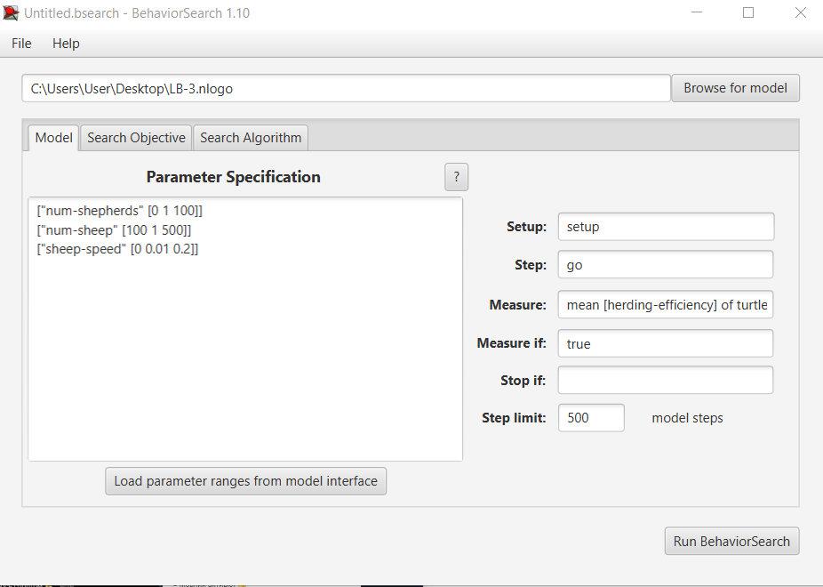
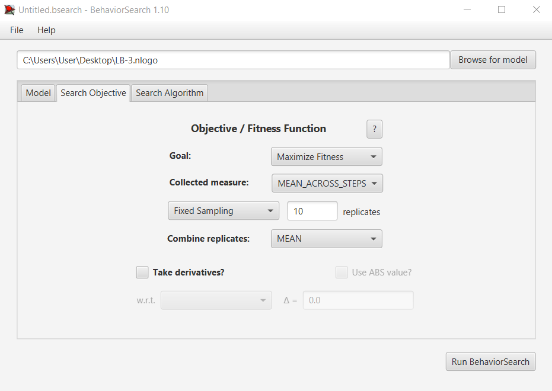
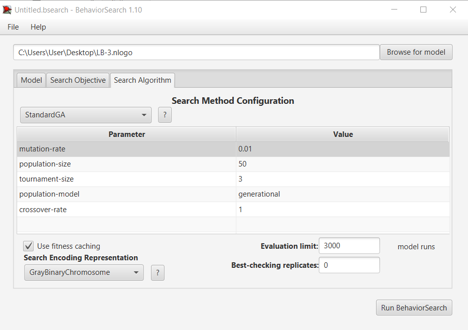
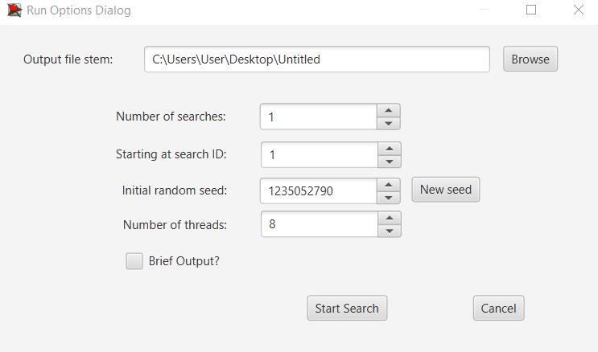
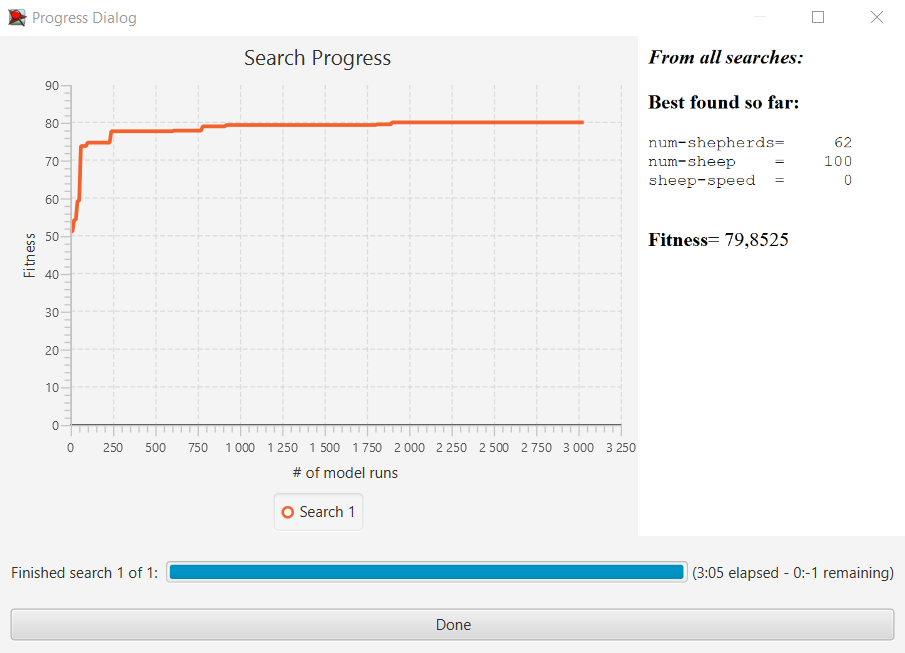
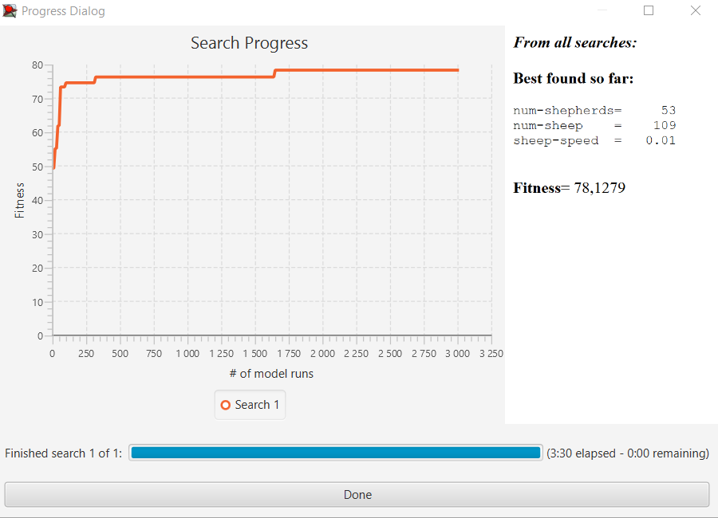

## Комп'ютерні системи імітаційного моделювання
## СПм-23-5, **Литвинов Андрій Павлович**
### Лабораторна робота №**3**. Використання засобів обчислювального интелекту для оптимізації імітаційних моделей

 

### Варіант 9, модель у середовищі NetLogo:
[Sheperds](http://www.netlogoweb.org/launch#http://www.netlogoweb.org/assets/modelslib/Sample%20Models/Biology/Shepherds.nlogo)

 

### Вербальний опис моделі:
Симуляція сбору овець пстухами у стадо. Пастухи дотримуються низки простих правил. Кожен пастух починає блукати випадковим чином. Якщо він натикається на вівцю, він підбирає вівцю та продовжує безладно блукати. Коли він натикається на іншу вівцю, він знаходить вільне місце поблизу, кладе свою вівцю та шукає іншу.

### Керуючі параметри:
- **num-sheep**: кількість овець у моделі. Цей параметр визначає, скільки овець буде створено під час ініціалізації моделі.
- **num-shepherds:**: кількість пастухів у моделі. Цей параметр задає кількість пастухів, які будуть створені.
- **sheep-speed**: швидкість переміщення овець. Визначає, як швидко вівці рухатимуться по простору.

### Внутрішні параметри:
- pcolor: колір патчів, який варіюється, щоб зробити візуалізацію приємнішою (відтінки зеленого).
- sheep-nearby (в змінній patches-own): кількість овець у сусідніх патчах, використовується для визначення насиченості області вівцями.
- carried-sheep (в змінній shepherds-own): це змінна для кожного пастуха, яка показує, чи несе він зараз вівцю. Якщо несе, то зберігається посилання на цю вівцю.
- found-herd? (в змінній shepherds-own): булева змінна, яка визначає, чи знайшов пастух стадо, куди можна скинути вівцю.
- hidden? (в змінній sheep): ця змінна використовується, щоб зробити вівцю "прихованою", коли її несе пастух (вона стає невидимою для інших пастухів).

### Показники роботи моделі:
- sheepless-neighborhoods: кількість патчів, навколо яких немає овець. Цей показник дає інформацію про те, наскільки овець "розсіяно" по території.
- herding-efficiency: ефективність збирання овець пастухами. Обчислюється як відсоткове співвідношення патчів без овець у їхньому оточенні до загальної кількості патчів без овець.

 

### Налаштування середовища BehaviorSearch:

**Обрана модель**:
<pre>
C:\Users\User\Desktop\LB-3.nlogo
</pre>
**Параметри моделі** (вкладка Model):  
*Параметри та їх модливі діапазони були **автоматично** вилучені середовищем BehaviorSearch із вибраної імітаційної моделі кнопкою «Завантажити діапазони параметрів із інтерфейсу моделі»*:
<pre>
["num-shepherds" [0 1 100]]
["num-sheep" [100 1 500]]
["sheep-speed" [0 0.01 0.2]]
</pre>
*Мінімальна кількість овець була встановлена за замовчуванням 100 для практичності моделі, оскільки при стандартних налаштуваннях алгоритм знижував це число до 0*  
Використовувана **міра**:  
Для фітнес-функції *(вона ж функція пристосованості або цільова функція)* було обрано **значення ефективності сбору овець**, та вказано у параметрі "**Measure**":
<pre>
mean [herding-efficiency] of turtles
</pre>
Середня ефективність повинна враховуватися **в середньому** за весь період симуляції тривалістю 1000 тактів
*Параметр "**Mesure if**" зі значення true, по суті, і означає, що враховуватимуться всі такти симуляції, а чи не частина їх. Іноді має сенс не враховувати деякі такти через хаос в деяких моделях на початку їх використання. Наприклад, це показано в прикладі з документації BehaviorSearch.  
Параметри "**Setup**" та "**Go**" вказують відповідні процедури ініціалізації та запуску в логіці моделі (зазвичай вони так і називаються). BehaviorSearch в процесі роботи, по суті, замість користувача запускає ці процедури.*  
Параметр зупинки за умовою ("**Stop if**") у разі не використовувався.  
Загальний вигляд вкладки налаштувань параметрів моделі:  

**Налаштування цільової функції** (вкладка Search Objective):  
Метою підбору параметрів імітаційної моделі, є **максимізація** значення ефективності пвстухів – це вказано через параметр "**Goal**" зі значенням **Maximize Fitness**. Тобто необхідно визначити такі параметри налаштувань моделі, у яких пастухи працюють з максимальною швидкістю. При цьому цікавить не просто середня ефективність у якийсь окремий момент симуляції, а середнє її значення за всю симуляцію (тривалість якої (1000 кроків) вказувалася на минулій вкладці). Для цього у параметрі "**Collected measure**", що визначає спосіб обліку значень обраного показника, вказано **MEAN_ACROSS_STEPS**.  
Щоб уникнути викривлення результатів через випадкові значення, що використовуються в логіці самої імітаційної моделі, **кожна симуляція повторюється по 10 разів**, результуюче значення розраховується як **середнє арифметичне**. *Якщо вважаєте вплив випадковості на те, що відбувається в обраній вами імітаційній моделі незначним - то повторні симуляції можуть бути і не потрібні.*  
Загальний вигляд вкладки налаштувань цільової функції:  

**Налаштування алгоритму пошуку** (вкладка Search Algorithm):  
*На цьому етапі було визначено модель, налаштовано її параметри
У ході дослідження на лабораторній роботі використовуються два алгоритми: Випадковий пошук(**RandomSearch**) і Простий генетичний алгоритм (**StandardGA**).  
Для цих алгоритмів, що вирішують завдання пошуку такого набору параметрів імітаційної моделі необхідно вказати "**Evaluation limit**" (число ітерацій пошуку, у разі ГА – це буде кількість поколінь), та "**Search Space Encoding Representation**" (спосіб кодування варіанта вирішення). Загальноприйнятого "кращого" способу кодування немає, треба куштувати, які підійдуть саме до вашої моделі.
Загальний вид вкладки налаштувань алгоритму пошуку:  

 

### Результати використання BehaviorSearch:
Діалогове вікно запуску пошуку :  

Результат пошуку параметрів імітаційної моделі, використовуючи **генетичний алгоритм**:  

Результат пошуку параметрів імітаційної моделі, використовуючи **випадковий пошук**:  

